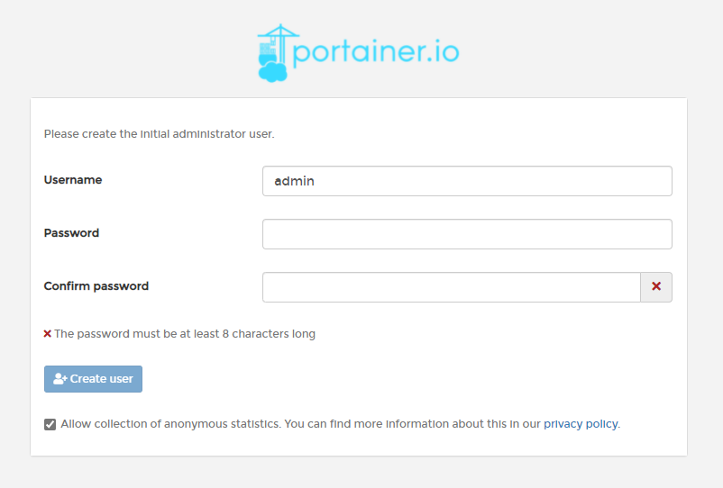
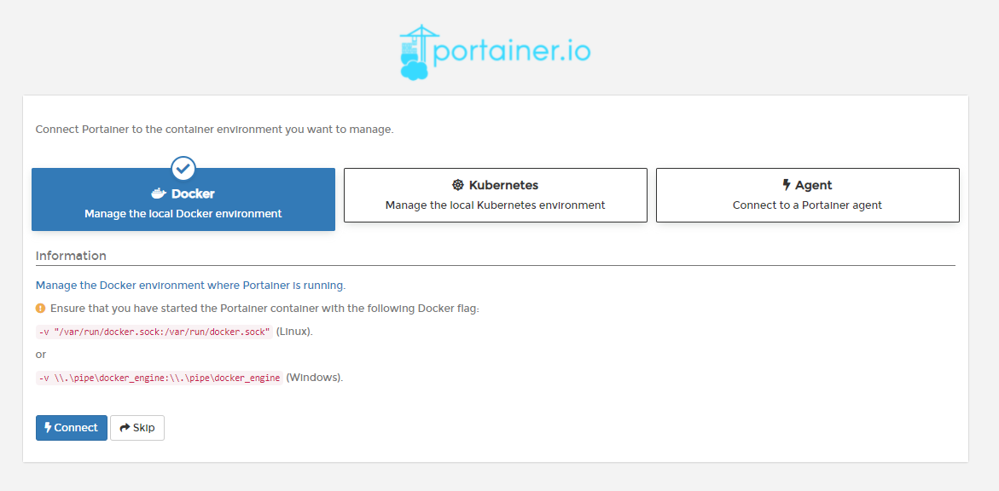
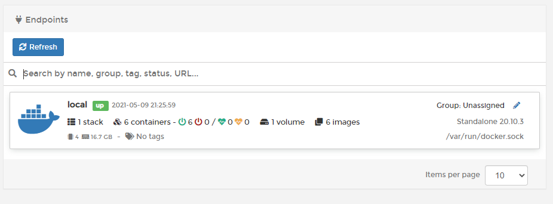
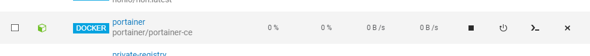

https://twitter.com/mfakane/status/1391161435523194883

QNAP Turbo NAS には [Container Station](https://www.qnap.com/solution/container_station/ja-jp/) と呼ばれるアプリがあり、Docker や LXC コンテナを走らせることができる。Docker Hub から検索してそのままコンテナを作成することができるので、これだけでありとあらゆるサーバアプリケーションやサービスを NAS 上に展開できる素敵アプリである。

一方、[Portainer](https://www.portainer.io/) は Web ベースのコンテナ管理ツールであり、Portainer CE として無償版が提供されている。もちろん Docker にも対応しており、わかりやすいが画面によりコンテナを管理できる。

Container Station の画面はシンプルでわかりやすくはあるが、Docker コンテナの管理に必要な機能を網羅しているとは言いがたいため、それを Portainer を導入することにより解決を図る。

<!-- more -->

# Container Station で使われる Docker は直接触れる

Container Station の中身は普通の Docker および LXC と変わらない使い方ができるようになっているようで、SSH からログインして通常通りコマンドを叩くことができる。

```
[~] # docker --version
Docker version 20.10.3, build c52c09e6b8
```

もちろんソケットも存在する。

```
[~] # ls -Al /var/run/docker.sock
srw-rw---- 1 admin administrators 0 2021-04-30 17:06 /var/run/docker.sock=
```

Portainer はローカルに存在する Docker のソケットを指定して管理できるので、これを投げ込めばよいことになる。

# Portainer のインストール

だいたい Portainer Documentation の [Install Guide - Docker](https://documentation.portainer.io/v2.0/deploy/ceinstalldocker/) 通りにするだけでできる。

データの永続化のためにボリュームを作成し、それと `docker.sock` をマウントして [portainer/portainer-ce](https://hub.docker.com/r/portainer/portainer-ce) を実行する。

```
[~] # docker volume create portainer_data
portainer_data
[~] # docker run -d -p 8000:8000 -p 9000:9000 --name=portainer --restart=always -v /var/run/docker.sock:/var/run/docker.sock -v portainer_data:/data portainer/portainer-ce
Unable to find image 'portainer/portainer-ce:latest' locally
latest: Pulling from portainer/portainer-ce
94cfa856b2b1: Pull complete
49d59ee0881a: Pull complete
527b866940d5: Pull complete
Digest: sha256:5064d8414091c175c55ef6f8744da1210819388c2136273b4607a629b7d93358
Status: Downloaded newer image for portainer/portainer-ce:latest
7db0fe3c0b64b8497d633c03a5ca8fe4e94d6b0e5e4fff65fe08618703458f31
```

# Portainer の初期設定

`http://<NAS のアドレス>:9000/` にアクセスすると初期設定画面が表示される。

## 管理者ユーザの設定

任意のユーザ名とパスワードを設定する。



## 接続先の設定

`Docker` を選択してローカルの環境に接続する。



## 設定完了

Portainer のホーム画面に遷移される。先ほど設定した接続先が表示される。



# Container Station にも反映される

Container Station はあくまで Docker に対する GUI なので、 docker コマンドを叩いたり、Portainer で操作をしてもちゃんと反映される。QNAP の機能だからといって連携がとれなくなるということもない。安心。

