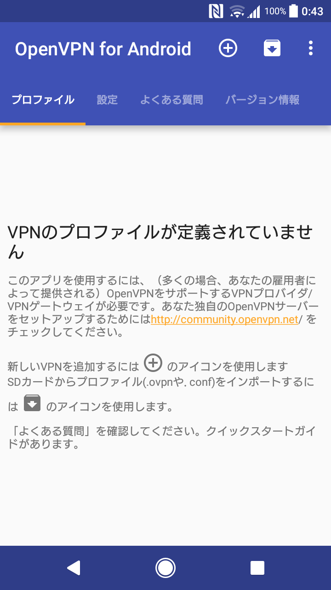
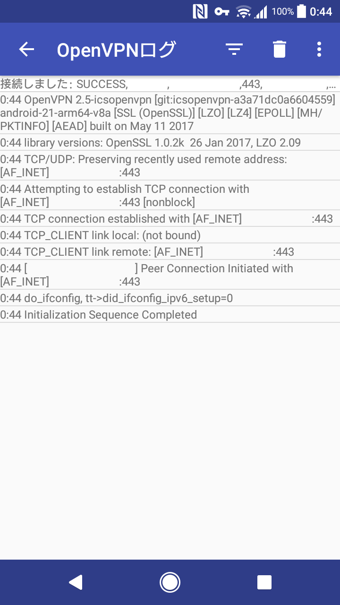

[前回立てた OpenVPN サーバ](../arch-openvpn-server-setup.md) に接続します。

<!-- more -->

## 事前準備

### クライアント証明書の作成
任意のマシンでサーバ証明書を作成した時と同じように以下の手順を実行します。
```
# easyrsa gen-req client1 nopass
```

以下のファイルが作成されます。
- `/etc/easy-rsa/pki/reqs/client1.req`
- `/etc/easy-rsa/pki/private/client1.key`

次にクライアント証明書を署名します。 (CA となるマシンが別の場合、事前にファイルを転送します)
```
# easyrsa sign-req client client1
```

以下のファイルが作成されます。
- `/etc/easy-rsa/pki/issued/client1.crt`

### クライアントプロファイルの作成
.ovpn 形式のプロファイルを作成するために [ovpngen](https://github.com/graysky2/ovpngen) ([AUR](https://aur.archlinux.org/packages/ovpngen/)) を使用します。
```
$ yaourt -S ovpngen
```

以下のパラメータを指定してクライアントプロファイルを作成します。
- サーバのホスト名もしくは IP アドレス
- CA 証明書のパス
- クライアント証明書のパス
- クライアント秘密鍵のパス
- TLS 共有鍵のパス
- ポート番号
- プロトコル (tcp または udp)

```
# ovpngen ovpn.example.com \
  /etc/openvpn/server/ca.crt \
  /etc/easy-rsa/pki/issued/client1.crt \
  /etc/easy-rsa/pki/private/client1.key \
  /etc/openvpn/server/ta.key \
  1194 \
  tcp > profile.ovpn
```

作成された `profile.ovpn` を開き、圧縮や暗号及び認証方式を設定する行をコメントから外し、サーバで設定したものと一致するよう変更します。
```
cipher AES-256-CBC
auth SHA512
comp-lzo
```

## Android から接続
上記で作成したプロファイルを何らかの手段で端末に転送します。
その後 [OpenVPN for Android](https://play.google.com/store/apps/details?id=de.blinkt.openvpn) をインストールし、起動します。

https://play.google.com/store/apps/details?id=de.blinkt.openvpn



画面の説明に従いインポートボタンをタップし、先ほど端末に転送したプロファイルを選択するとインポートされます。

### 接続
作成したプロファイルをタップするとログ画面が開かれ接続を開始します。
正常に接続されると、ステータスバーに鍵アイコンが表示されます。


