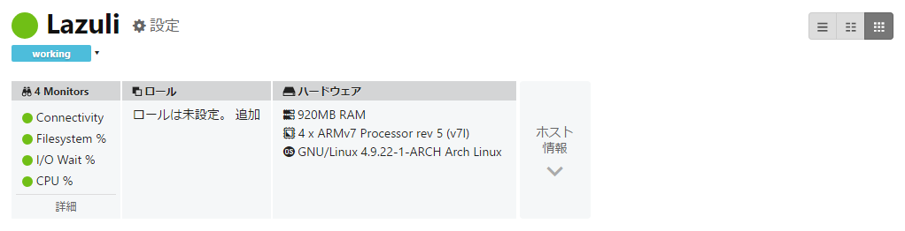

Arch Linux で [Mackerel](https://mackerel.io/) を使いたいあまり Mackerel 公式プラグイン集のパッケージを作成して、[AUR に投稿しました](https://aur.archlinux.org/packages/?K=mfakane&SeB=m)。以下の二種類です。  
両方とも GitHub にある公式プラグイン集のソースコードからビルドするものとなっています。

- [mackerel-agent-plugins-git](https://aur.archlinux.org/packages/mackerel-agent-plugins-git/)
- [mackerel-check-plugins-git](https://aur.archlinux.org/packages/mackerel-check-plugins-git/)

<!-- more -->

Arch で Mackerel を使う際にこちらの AUR パッケージ [mackerel-agent-git](https://aur.archlinux.org/packages/mackerel-agent-git/) を使わせて頂いたのですが、パッケージ バージョン `0.39.3-1` 現在そのままですと `mackerel-agent` を叩いても何もしないものをビルドしてしまうようでしたので、
`PKGBUILD` の `build()` の中の以下の行を消して、代わりに `make build` を呼ぶようにしたらうまくビルドできました。

```bash
  go get -d github.com/mackerelio/mackerel-agent
  go build -o build/mackerel-agent \
    -ldflags="\
      -X github.com/mackerelio/mackerel-agent/version.GITCOMMIT=`git rev-parse --short HEAD` \
      -X github.com/mackerelio/mackerel-agent/version.VERSION=`git describe --tags --abbrev=0 | sed 's/^v//' | sed 's/\+.*$$//'` " \
    github.com/mackerelio/mackerel-agent
```

[我が家の Raspberry Pi には Arch Linux ARM が入っておりますが](../../kb/raspi-arch-initial-setup.md)、時間はかかるものの無事ビルドでき Mackerel から監視できております。
